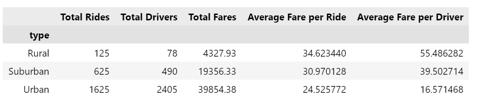
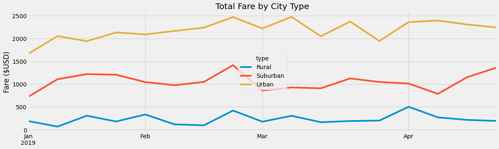

# PyBer_Analysis
---
### Overview
---
The purpose of this analysis was to look for differences in PyBer ride sharing data between different types of cities. This information is useful to PyBer executives looking to adjust their business model and maximize revenue.

### Results
---
Figure 1. Ride Share Data by City Type

Figure 1 breaks down all of the PyBer ride share data by city type. Urban cities have the highest number of total rides by far, as expected. This is likely due to higher population and population density within urban cities and the tendency for people living in urban areas to not own cars and rely on other modes of transportation. It follows that the number of total drivers and the raw fares collected in urban areas are also the highest in urban areas. However, the average fare per ride is lowest in urban areas and highest in rural areas. This could be due to rides in urban areas being shorter in length on average or rides in rural areas being longer on average. Similarly, average fare per driver is lowest in urban areas. This is due to oversaturation of drivers in urban markets; urban areas have the greatest ratio of drivers to rides by far, even going so far as having more drivers than rides, which lowers the number of rides each driver will take on average. Suburban areas are generally the intermediate between urban and rural areas and have values in between the two other city types for each metric examined.

Figure 2. Total Fares by City Type

---
Figure 2 shows total collected fare by city type as a time series between 01/01/2019 and 04/28/2019. For the most part, the three city types have similar trends, increasing and decreasing at the same time. This breaks down a bit towards the end of March and into April, but the differences in trend are no longer than one week and likely not highly significant. One week of note is the 2nd to last week of February, when all three city types see a spike in fares. This week contains either the highest or 2nd highest amount of fares collected for each city type. This could possibly be explained by a big event attracting visitors without cars happening in the area at the time.

### Summary

Based on the information collected and analysis performed, PyBer executives could stand to employ fewer drivers in urban areas. While these areas typically have the most people and theoretically the most demand, the profitability of an individual driver is shown to be substantially lower than in less populated areas. Along the same lines, surcharges for rides in urban areas could be introduced in order to raise the average fare per ride. The combination of these two adjustments could lead to greater profitability for both PyBer and drivers in urban areas, but would come at the expense of laying off a number of urban drivers. Lastly, PyBer executives should look to capitalize on time periods with high forecasted demand. For example, if the previously mentioned spike in February was accurately predicted, rates could have been increased to maximize revenue. Applying a forward-thinking approach to pricing their rides could lead to income growth for both individual drivers and PyBer as a company.
